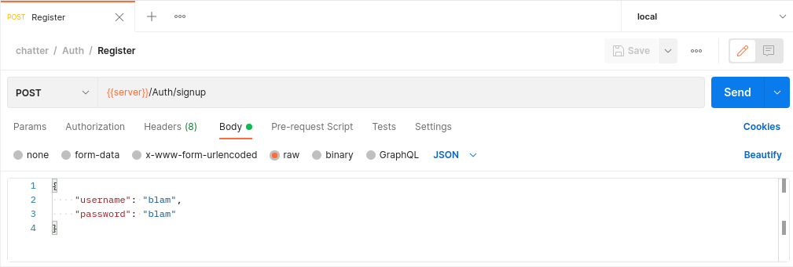

# Chatter 3000 the best of the best 
#### Réalisé par MaximeDzN

### 1.Prérequis

#### *BASE DE DONNÉES:*

* MariaDB 10.3
    * db: chatter
    * login: root
    * mdp: root

#### *BACKEND:*

* Java Development Kit 16
* Apache Maven 3.6.3

#### *FRONTEND:*

* Angular CLI 13
* NodesJS 16

### 2. Lancer en mode développement

Lorsque-vous aurez récupérer le projet. Vous aurez deux dossiers. "back" et "front".

1. Vous allez tout d'abord commencer par lancer le backend en vous rendant de le dossier "back" et en lançant la commande "mvn spring-boot:run". Cette commande lancera alors le serveur tomcat permettant de faire fonctionner l'application

2. Ensuite vous allez vous rendre avec un autre terminal dans le dossier "front". Ici vous devrez suivre une marche à suivre ultra complexe pour vos faibles neurones:
* Lancez d'abord la commande :
> npm i
* Ensuite lancez la commande :
> ng serve

Et voilà !

### 3. Création de compte

pour vous connectez vous devez utiliser un outil pouvant communiquer avec une API (postman par exemple)

Il vous suffit de remplir les informations suivantes pour créer un compte.

* {{server}} = http://localhost:5000/chatter/api
* username: "votre username"
* password: "votre password"

